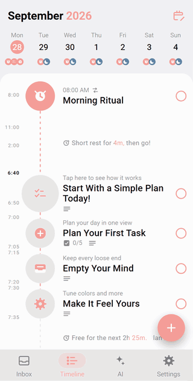
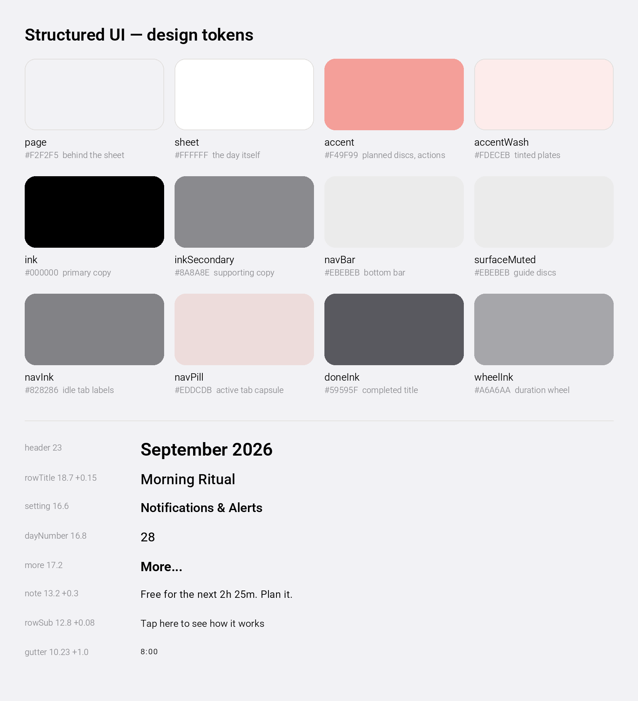

<p align="center">
  <a href="https://structured-ui.edgeone.cool"></a>
</p>

<h1 align="center">Structured UI</h1>

<p align="center">
  <a href="https://structured-ui.edgeone.cool"></a>
</p>

<p align="center">
  A high-fidelity, interactive recreation of the Structured day-planner Android app — real components, real navigation and local state, running in your browser.<br>
  <a href="DESIGN.md">DESIGN.md</a> · <a href="#design-notes">Design notes</a> · <a href="#explore-the-prototype">Explore</a> · <a href="#run-locally">Run locally</a> · <a href="#scope-and-limitations">Scope</a> · <a href="https://github.com/migrant620/awesome-app-design-md">More apps →</a>
</p>

---

Created to explore how Structured turns a whole day into something you can see at a glance — one vertical timeline spine, a disc per task, and a single coral accent carrying every plan and action. For the real experience of the planner itself, explore [Structured](https://structured.app).

Everything runs locally in your browser; it does not connect to any Structured or calendar account and loads no live data.

## Design notes

What makes Structured's interface work, and what this recreation had to get right.

**The day is one vertical line.** Every task is a disc on a single spine — pink dashes between planned rows, a solid grey stub into unscheduled ones — with time labels running down the left gutter. The spine, not a list of cards, is what makes the day readable, so the recreation keeps it unbroken from the first row to the last, even under a bottom sheet.

**One coral does all the work.** `#F49F99` is the app's only real colour: planned discs, the action cards, the editor's selection pill, the "More..." links and the completion ring all share it, with `#FDECEB` as its wash. Greys do everything else — `#8A8A8E` for supporting copy, `#EBEBEB` for muted discs and the bottom bar, `#EDDCDB` for the active tab's capsule. Give each action its own hue and the timeline stops being one plan.

**Completed means struck through, not greyed away.** A completed task keeps its place on the spine: the title takes a line-through, its disc turns muted, and the action card flips to "Incomplete". The day's history stays visible instead of vanishing.

**Weight is set per role, not nominal.** The face is Roboto, but each typographic role registers its own static instance cut from the variable font — twelve roles from gutter labels at 10.2 dp to the month header at 23 dp — because nominal weights read too light in a browser. Hierarchy comes from real weight stops and careful tracking, not from extra greys.

**Sheets keep the day in view.** The editor, the detail sheet and the delete confirmation arrive as rounded sheets over the live timeline, dimmed by one scrim. The plan stays legible behind them, and completing or deleting a task updates the timeline you can still see.

**Empty states are invitations.** The first-run timeline is not blank: grey guide discs ("Start With a Simple Plan Today!", "Plan Your First Task" with its own checklist) teach the spine by sitting on it, and the inbox explains itself in one line.

## Design system at a glance

<p align="center"></p>

The full token set — colours, type scale, spacing, radii and component notes — is in [DESIGN.md](DESIGN.md); the values live in [`src/theme/tokens.ts`](src/theme/tokens.ts).

## Explore the prototype

| Area | Things to try |
|---|---|
| Day timeline | See the first-run plan with its guide rows, gutter time labels and the black "now" marker; switch days on the week strip. |
| Create a task | Tap **+**. Pick a suggestion chip or type a title, then set **When?** and **How long?** on the duration wheel — the selected segment carries the coral pill. |
| Task detail | Tap a task. The sheet shows its time range with Delete / Duplicate / Complete cards and **Edit Task**. |
| Complete | Tap **Complete** — the title strikes through, the disc mutes, and the card becomes **Incomplete**. |
| Delete | Tap **Delete** and confirm on the dialog; the row leaves the spine. |
| Inbox | Open the **Inbox** tab for the thoughts capture with its empty state and **New Inbox Task**. |
| Settings | Open the **Settings** tab for the Pro banner, import rows, notifications and support sections. |

### A first walkthrough

1. On the timeline, tap **+**, pick **Watch a Film**, then step through **When?** and **How long?** — watch the coral pill follow your selection.
2. Create the task and find it on the spine with its own time range.
3. Tap any task to open the detail sheet, then tap **Complete** and watch the title strike through.
4. Open the same task again and tap **Delete**, then confirm — the spine closes the gap.
5. Switch to **Inbox** and **Settings** to see the two supporting tabs.

Data is static and local to the page; reloading returns you to the first-run plan.

## Run locally

Use Node.js 22.13 or newer in the Node.js 22 release line, with npm.

```bash
npm ci --ignore-scripts
npm run web
```

Open the local URL printed by Expo. Dependency installation requires an internet connection. No Structured account and no API key are required.

### Build for the web

```bash
npm run typecheck
npm run build:web
```

The static output is written to `dist/`. Serve that directory over HTTP or HTTPS; opening `index.html` directly as a local file is not supported.

## Demo build

The published demo at <https://structured-ui.edgeone.cool> is built from this repository. It was last rebuilt and redeployed on 2026-10-10 (EdgeOne deployment `dpgjoduvywre`, source revision `670c1546`).

## Scope and limitations

- **First batch of screens.** This edition covers the day timeline in its first-run, populated, completed and delete-confirmation states, the two-step task editor, the task detail sheet, the inbox tab and the settings tab. Recurring-task editing, calendar import, the colour picker wheel, reminders and the Pro purchase flow are not built.
- **Every task, note and label is fictional.** All task titles, notes, inbox copy and settings labels are original content written for this study. Times, dates and counts are illustrative. No real person's content is reproduced.
- **Icons are redrawn.** The app's own icon face is proprietary, so every icon here is an original vector drawing.
- **Typeface.** The interface face is Roboto under the SIL Open Font License 1.1, bundled locally in `assets/fonts/` as twelve static instances, one per typographic role.
- **Mobile layout on the web.** The interface is designed for a 393 dp phone column; on wider screens it stays centred rather than stretching.
- **Validation scope.** The first-batch screens have been checked in Chromium at 393 dp width. This does not establish complete feature coverage, Safari/Firefox compatibility, or native Android/iOS acceptance.

## Commission a prototype

Have an app whose screens you want to put in front of your team, a client or investors? I recreate chosen app interfaces and flows as high-fidelity, interactive prototypes and hand over the source code. [Open an issue](https://github.com/migrant620/structured-ui/issues/new?title=Prototype%20enquiry) with the app, the flow you need and your timeline.

## License

The prototype's original code and materials are **source-available for noncommercial self-directed study and research only**, under the [M620 Study and Research License](LICENSE). Commercial products, business use, client deliverables, and hosted services are not permitted without a separate written license. Free access does not itself permit commercial use.

This is not an open-source license. Third-party components retain their own licenses.

## Attribution

This is an independent prototype by M620, not an official Structured or unorderly product and not affiliated with or endorsed by unorderly. Third-party names identify the interface being demonstrated.

Bundled fonts retain their own licenses: Roboto under the SIL Open Font License 1.1. See the third-party notices in the build output.
